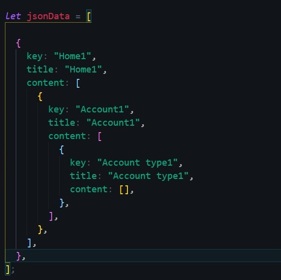

<div align="center"><h1>Accordify</h1></div>
<div align="center"><h4>Making Nested accordion in React from JSON</h4></div>
<div align="center"><h4>Read more about it on this post</h4></div>

```
https://ashyaa.medium.com/making-a-nested-accordion-in-react-from-json-7d307b038f84#4d2b
```
<pre><div align="center">   </div></pre>
